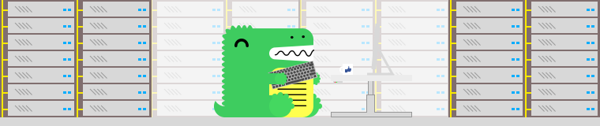

### 项目主题

本任务主要进行以日本排放核废水事件为主题的社交媒体文本评论数据爬服、分析与可视化。

### 实现步骤

本实验遵从数据挖掘的一般流程，首先对数据进行读取，常规的探索后，进行数据降维操作，随后直接选择sklearn模块中的KMeans算法进行建模，通过轮廓系数对KMeans算法进行K值调优，选择最优的K值进行模型训练，最后通过统计分析对聚类结果进行画像分析，从而明确每一类的特征。

### 框架简介
#### 本次前端界面采用Docusaurus构建

Docusaurus 是 Facebook 专门为开源项目开发者提供的一款易于维护的静态网站创建工具。

+ 启动简单 ：Docusaurus的构建可以在很短的时间内启动和运行。Docusaurus已经构建了处理网站的过程，开发人员只需专注于项目。

+ 本地化： Docusaurus 通过CrowdIn 提供本地化支持。通过翻译文档增强国际社区的地位。

+ 可自定义：Docusaurus 可自定义项目需要的关键页面，包括主页，文档部分，博客和其他页面

