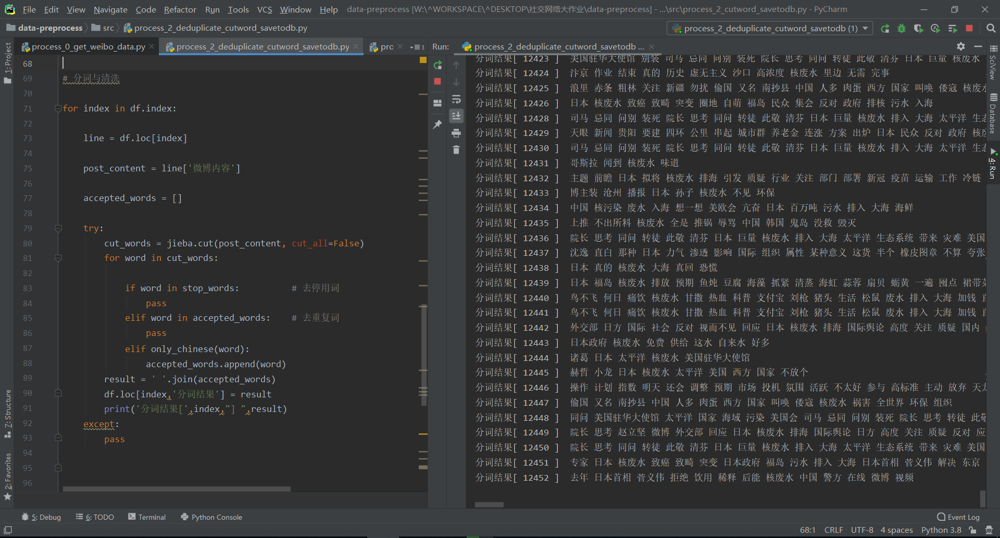

# 中文分词并筛除停用词

```
# 分词与清洗

for index in df.index:
    line = df.loc[index]
    post_content = line['微博内容']
    accepted_words = []
    try:
        cut_words = jieba.cut(post_content, cut_all=False)
        for word in cut_words: 
            if word in stop_words:          # 去停用词
                pass
            elif word in accepted_words:    # 去重复词
                pass
            elif only_chinese(word):
                accepted_words.append(word)
        result = ' '.join(accepted_words)
        df.loc[index,'分词结果'] = result
        print('分词结果[',index,"] ",result)
    except:
        pass

```
输出结果：

