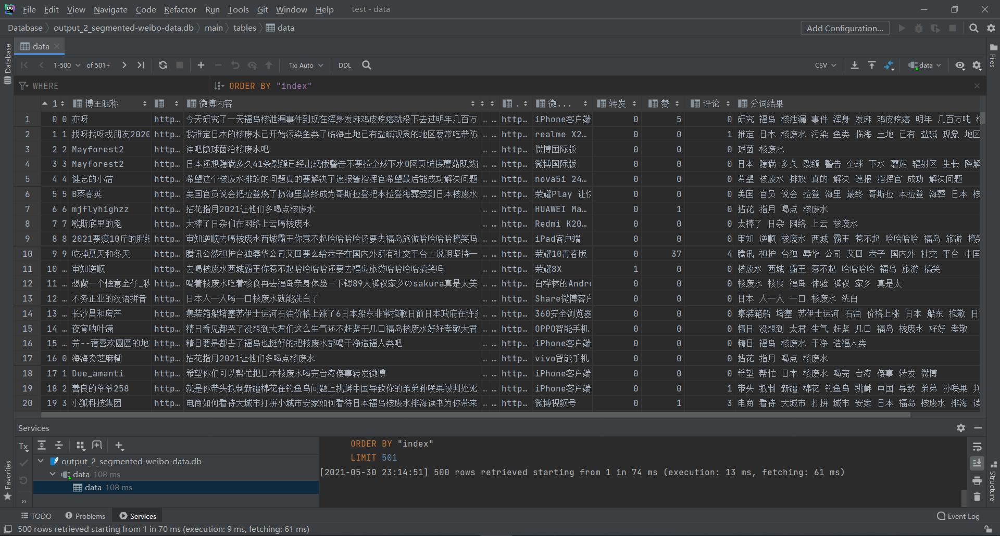
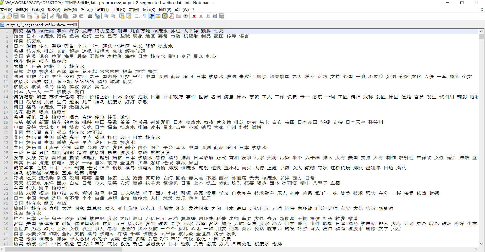

# 分词结果存储

将分词结果存储到sqlite3数据库中，另外也保存到txt文件中。
表结构由 pandas sql API 自动生成。数据表名为data，其中各列分别为博主昵称、博主主页、微博内容、发布位置、发布时间、微博地址、微博来源、转发	、评论、赞、分词结果。

Sqlite3 保存数据：

```
# 数据存储到 sqlite 数据库中

connection = sqlite3.connect(r"../output_2_segmented-weibo-data.db")

pd.io.sql.to_sql(df,'data',sqlite3.connect(r"../output_2_segmented-weibo-data.db"), if_exists='append')
```


文本文件保存：

```
# 数据存储到 txt 文本中

txtfile = open(r"../output_2_segmented-weibo-data.txt",'w')
for index in df.index:
    txtfile.write(str(df.loc[index,'分词结果'])+"\n")
txtfile.close()

```


