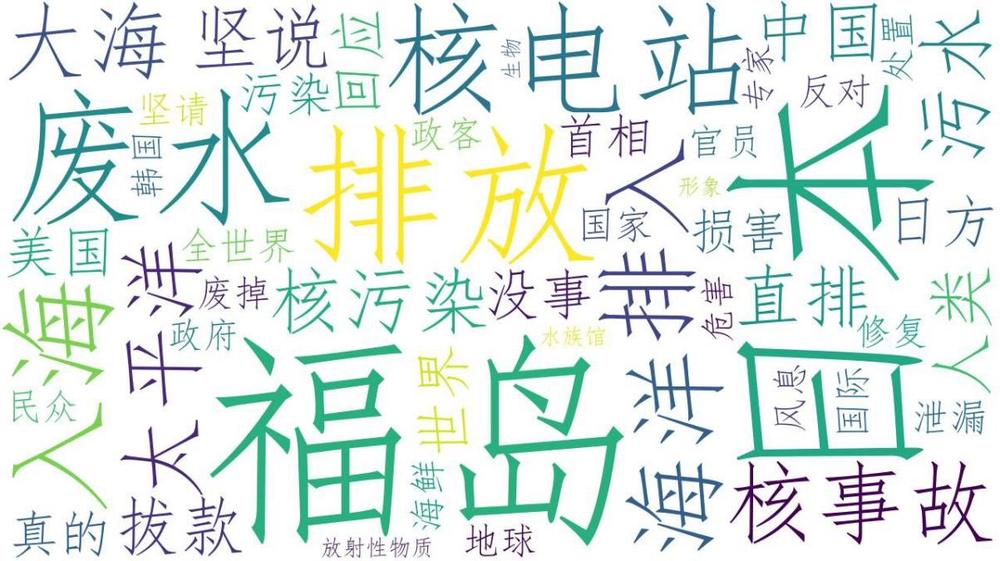

# 关键词生成可视化词云

使用 wordcloud 生成词云。使用第二部分分词处理后的文本数据进行处理，按空格分割并统计生成频率映射；再传递给wordcloud 导出词云图。

```
wordcloud = WordCloud(
		background_color='#FFFFFF',
		font_path="C:\Windows\Fonts\simfang.ttf",
		width=1280,
		height=720,
		max_words=50
	)

frequency = {}
segmented_contents_txt_file = open(r"../output_2_segmented-weibo-data.txt")
for line in segmented_contents_txt_file:
    words = line.split(' ')
    for word in words:
        if word in frequency:
            frequency[word] = frequency[word] + 1
        else:
            frequency[word] = 1

wordcloud.fit_words(frequency)
wordcloud.to_file(r'../output_4_wordcloud.jpg')
```

根据tfidf算法排序结果生成的top50 关键词词云图：


