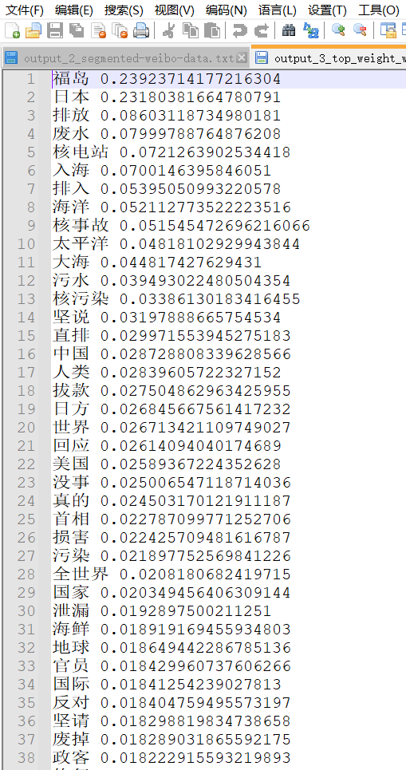

# 词频统计

```
lines = []
frequency = {}
segmented_contents_txt_file = open(r"../output_2_segmented-weibo-data.txt",'r')
for line in segmented_contents_txt_file:
    lines.append(line)
    words = line.split(' ')
    for word in words:
        if word in frequency:
            frequency[word] = frequency[word] + 1
        else:
            frequency[word] = 1

# 持久化保存
frequency_txt_file = open(r"../output_3_top_weight_words.txt", 'w')
for keyword in keywords:
    print(keyword[0],keyword[1])
    frequency_txt_file.write(str(keyword[0])+" "+str(keyword[1])+"\n")
frequency_txt_file.close()
```


