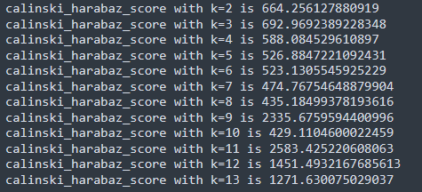
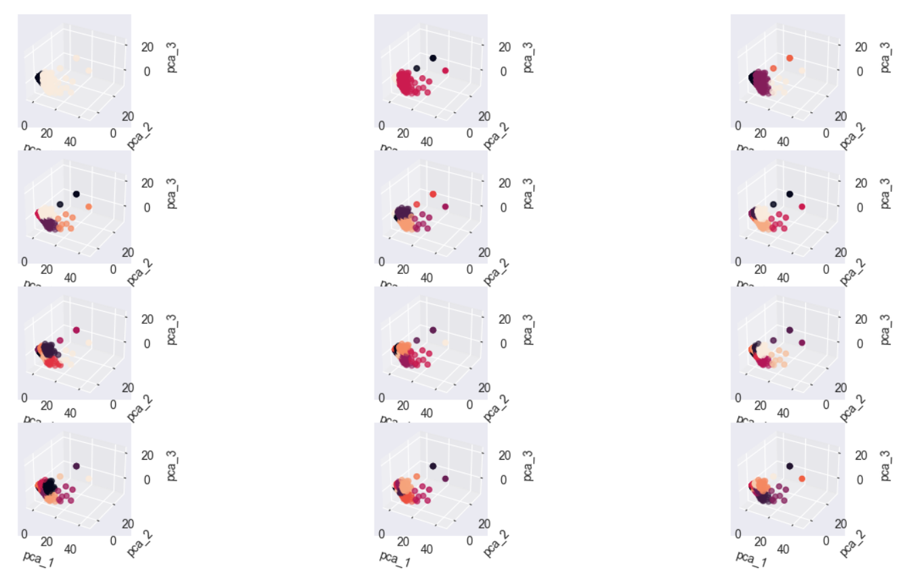

# 分析不同k值聚类算法效果&&聚类结果的可视化

通过循环选择k=2-13，并比较得分，将12种结果三维可视化显示出来

```
#尝试k=2~14
for k in range(2, 14):    
    est = KMeans(n_clusters=k, random_state=111)    
    cluster_1_color = {0:'red',1:'green',2:'blue',3:'yellow',4:'cyan',5:'black',6:'magenta', 7:'#fff0f5', 8:'#ffdab9',9:'#ffa500' }
    # 作用到降维后的数据上    
    y_pred = est.fit_predict(X_pca)    
    # 评估不同k值聚类算法效果    
    calinski_harabaz_score = metrics.calinski_harabasz_score(X_pca_frame, y_pred)  # X_pca_frame：表示要聚类的样本数据，一般形如（samples，features）的格式。y_pred：即聚类之后得到的label标签，形如（samples，）的格式    
    d.update({k: calinski_harabaz_score})    
    print('calinski_harabaz_score with k={0} is {1}'.format(k, calinski_harabaz_score))  # CH score的数值越大越好    
    # 生成三维图形，每个样本点的坐标分别是三个主成分的值    
    ax = plt.subplot(4, 3, k - 1, projection='3d') #将figure设置的画布大小分成几个部分，表示4(row)x3(colu),即将画布分成4x3，四行三列的12块区域，k-1表示选择图形输出的区域在第k-1块，图形输出区域参数必须在“行x列”范围    
    ax.scatter(X_pca_frame.pca_1, X_pca_frame.pca_2, X_pca_frame.pca_3, c=y_pred)  # pca_1、pca_2、pca_3为输入数据，c表示颜色序列    
    ax.set_xlabel('pca_1')    
    ax.set_ylabel('pca_2')    
    ax.set_zlabel('pca_3')
plt.show()
```




通过调整k值，获得不同的聚类结果，我们发现当k取11时，聚类得分最好，聚簇的效果最好
