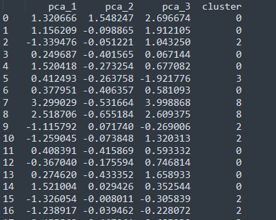

# 训练聚类模型

这里选择k-means的原因是它具有优化迭代功能，可以设置不同的初值比较哪个更好

```
#此处指定聚类中心K=10,效果最好
est = KMeans(n_clusters=10)
est.fit(X_pca)
#获取数据标签值
kmeans_clustering_labels = pd.DataFrame(est.labels_,columns=['cluster'])
#将聚类结果与降维特征数据进行拼接
X_pca_frame = pd.concat([X_pca_frame,kmeans_clustering_labels], axis=1)

```


