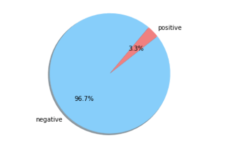
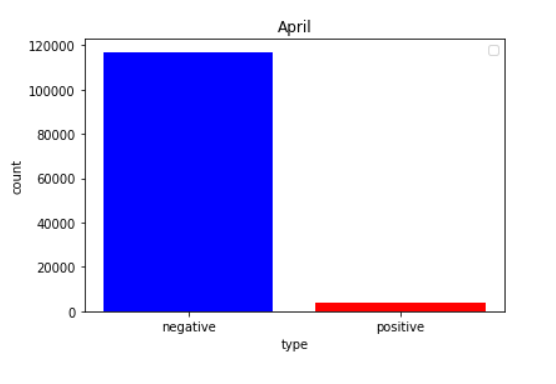
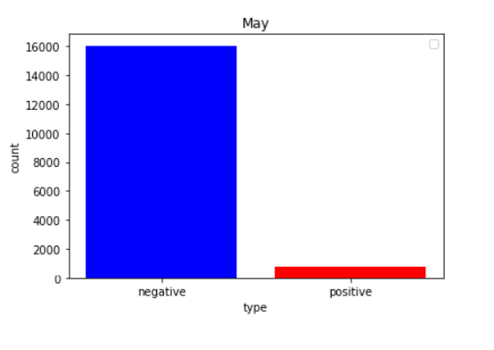

# 情感分析与可视化

### 预测无标签微博数据集
```
column_names = [str(i) for i in range(13)]
unlabeled_data = pd.read_csv("./data/data.csv",encoding="utf-8",names=column_names)
unlabeled_data["4"]
unlabeled_data = unlabeled_data.dropna(subset=["4"])
unlabeled_data["processed"] = unlabeled_data["4"].apply(fenci_process)
unlabeled_feature = vectorizer.transform(unlabeled_data["processed"])
dt_model = DecisionTreeClassifier() 
dt_model.fit(x_train,y_train) 
y_pred = dt_model.predict(unlabeled_feature)
```

### 统计积极与消极情感在样本中的占比，画出饼状图


通过占比图可以看出，超过95%的微博评论，对于日本倾倒核废水持消极态度，仅有3.3%的微博评论分类为积极。可见绝大多数中国网民反对日本倾倒核废水，并在微博上发表了自己的评论。

### 统计积极与消极情感在样本中的占比，画出饼状图
#### 两个月微博数据对比




可以看出，五月份的微博数据无论积极与消极，相比较四月数据量均有上升，体现出核废水的微博的热度在五月更高，同时两个月中对于核废水的消极评论均远高于积极评论。

