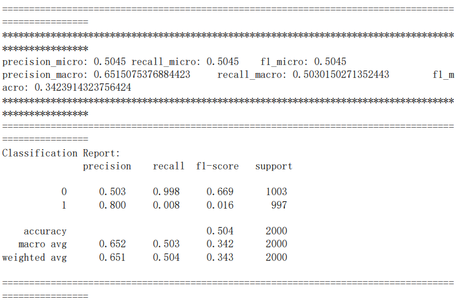
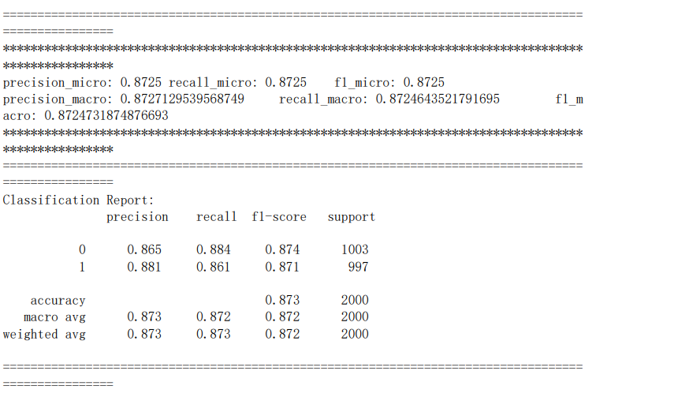
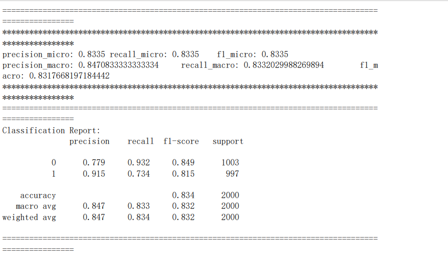

# 模型训练

#### 通过已标过签的微博评论数据，将评论根据积极、消极分为两类标签

#### 提取数据特征
采用TF-IDF文本特征提取
```
from sklearn.feature_extraction.text import TfidfVectorizer #TF-IDF文本特征提取
vectorizer = TfidfVectorizer() 
features=vectorizer.fit_transform(data["processed"])
labels = data["label"].values
print("data len:", len(data["processed"]))
```
#### 划分测试集与数据集
将数据的80%划分为训练集，20%为测试集
```
x_train, x_test, y_train, y_test = train_test_split(features,labels,test_size=0.2,random_state=20)
```
#### KNN算法

#### DecisionTree算法

#### SVM算法


### 对比三种算法的precision最终选择准确度最高的决策树作为最后情感分析分类算法