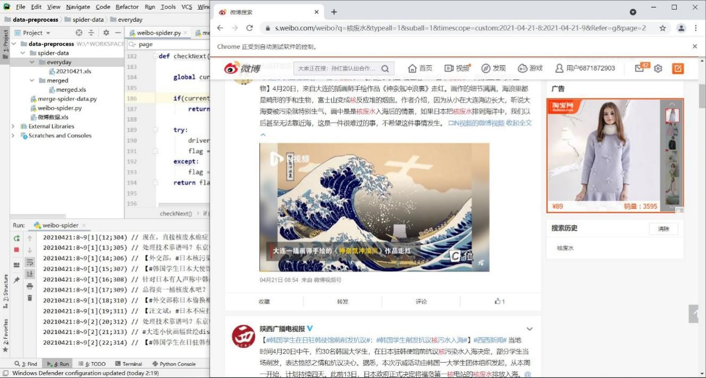

# 爬虫代码

基于实验二的微博爬虫代码进行。注意到单日超过50页时可能出现循环抓取重复数据（微博接口限制50页），对请求页码判断逻辑进行修正；当页码大于49时自动返回，认为不再存在有效的下一页、转移到下一个时段。

爬取过程分为两层循环。外层循环按日期，内层循环按小时。
使用以小时为单位爬取，每小时最多可获取50页数据，确保得到足够的数据量。


```
# 外层循环：每天

  current_date = start_date
  while current_date <= end_date:
​    current_day_post_counter = 0
​    current_date_data_file = xlwt.Workbook(encoding='utf-8')
​    sheet = current_date_data_file.add_sheet("data")
​    initXLS()
​    current_hour = 0
​    current_day_post_counter = 0
​    \# 内层循环：每小时

​    while current_hour <= 23:
​      current_hour_post_counter = 0
​      current_hour_page_counter = 1
​      url = current_url + '&typeall=1&suball=1&timescope=custom:' + current_date.strftime("%Y-%m-%d-") + str(current_hour) + ':' + current_date.strftime("%Y-%m-%d-") + str(current_hour+1) + '&Refer=g'
​      driver.get(url)
​      handlePage() # 处理当前页面内容
​      current_hour = current_hour + 1

​    \# xls rename
​    src = "./spider-data/everyday/" + current_date.strftime("%Y%m%d") + ".xls"
​    dest = "./spider-data/everyday/" + current_date.strftime("%Y%m%d") + "(" + str(current_day_post_counter) + ")" + ".xls"
​    os.rename(src,dest)

​    \# goto next day
​    current_day_post_counter = 0
​    current_date = current_date + datetime.timedelta(days=1)
\# time.sleep(1)
```

```
\# ********************************************************************************

\#         辅助函数，考虑页面加载完成后得到页面所需要的内容

\# ********************************************************************************

\# 页面加载完成后，对页面内容进行处理
def handlePage():
  global current_hour_page_counter
  global current_hour_post_counter
  global current_day_post_counter
  while True:
​    \# 之前认为可能需要sleep等待页面加载，后来发现程序执行会等待页面加载完毕
​    \# sleep的原因是对付微博的反爬虫机制，抓取太快可能会判定为机器人，需要输入验证码
​    time.sleep(1)
​    \# 先行判定是否有内容
​    if checkContent():
​      \# print("getContent")
​      getContent()
​      \# 先行判定是否有下一页按钮
​      if checkNext():
​        current_hour_page_counter = current_hour_page_counter + 1
​        \# 拿到下一页按钮
​        next_page_btn = driver.find_element_by_css_selector("#pl_feedlist_index > div.m-page > div > a.next")
​        next_page_btn.click()
​      else:
​        \# print("no Next")
​        break
​    else:
​      \# print("no Content")
​      break
```
运行效果

