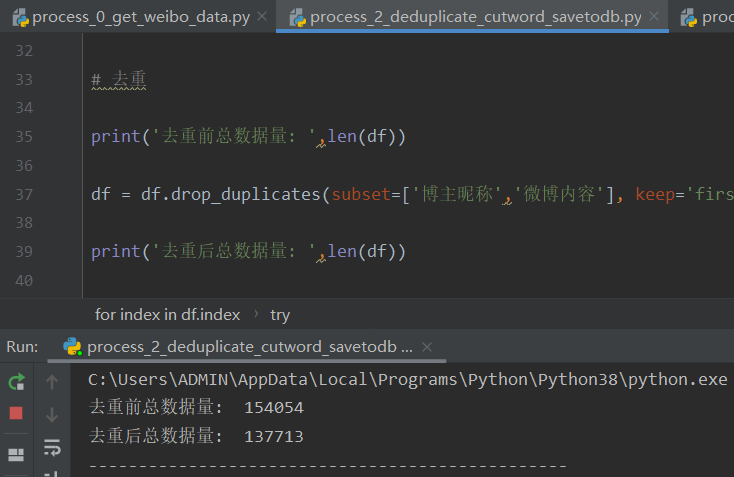

# 去除重复数据

去重逻辑：同一用户、同一内容，视为重复。不同用户、相同内容，视为不同。

通过如下代码，实现文本数据集按照文本内容去重。根据微博地址判断是否重复。

```
for index in df.index:
    line = df.loc[index]
    post_content = line['微博内容']
    accepted_words = []
    try:
        cut_words = jieba.cut(post_content, cut_all=False)
        for word in cut_words: 
            if word in stop_words:          # 去停用词
                pass
            elif word in accepted_words:    # 去重复词
                pass
            elif len(word)==1:              # 去掉无意义的单字
                pass
            elif only_chinese(word):		# 去除非中文的数字与字母
                accepted_words.append(word)
        result = ' '.join(accepted_words)
        df.loc[index,'分词结果'] = result
        # print(index,"\t",df.loc[index,'分词结果'])
    except:
        pass
```

爬取总数15.4万条，去重后13.7万条。即存在约1.7万条微博是相同用户发送的相同内容，被剔除。


