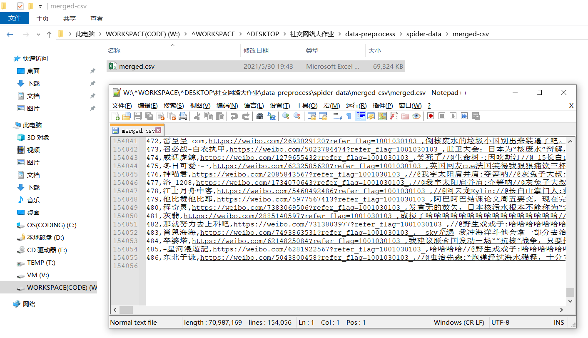

# 数据整合

将爬取保存的 xls 整合为 csv。这里由于pandas对xls格式的字符编码兼容性问题，在代码中生成了xlsx格式的临时文件以简化处理流程。

```
import os
import time
import win32com.client as win32
import pandas as pd

input_xls_foler = os.getcwd()+"\\..\\spider-data\\raw-xls"
output_xlsx_folder = os.getcwd()+"\\..\\spider-data\\temp"


excel = win32.gencache.EnsureDispatch('Excel.Application')
for xls_file in os.listdir(input_xls_foler):
    filename = xls_file.split(".")[0]
    wb = excel.Workbooks.Open(input_xls_foler+"\\"+xls_file)
    wb.SaveAs(output_xlsx_folder+"\\"+filename + ".xlsx", FileFormat=51)  # FileFormat = 51 is for .xlsx extension
    wb.Close()  # FileFormat = 56 is for .xls extension
    excel.Application.Quit()


df_list = []
for xlsx_file in os.listdir(os.getcwd()+"\\..\\spider-data\\temp"):
    df_list.append(pd.read_excel(os.getcwd()+"\\..\\spider-data\\temp\\"+xlsx_file))
df = pd.concat(df_list)
df.to_csv(r'../spider-data/merged-csv/merged.csv', encoding='utf-8')
```

整合为一个csv文件。爬取数据从20210401至20210530，共约15万条微博文本。


